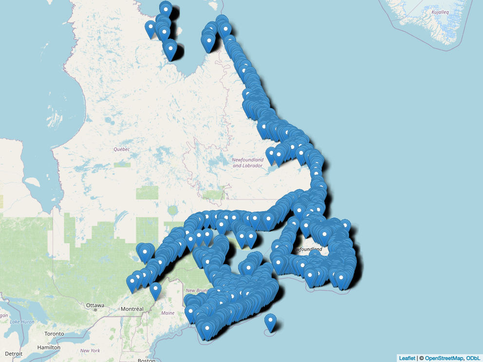

## Canada Atlantic Bird Colonies

<https://open.canada.ca/data/en/dataset/87bf8597-4be4-4ec2-9ee3-797f5eafbd97>

{#birds}

## Observatoire global du Saint-Laurent

Je n'ai pas trouvé de données de type recensement, quoique il y a des [inventaires de mammifères marins](https://catalogue.ogsl.ca/fr/dataset/ca-cioos_d72ab97d-7de2-4ca8-99d7-0898cfae8d65).
