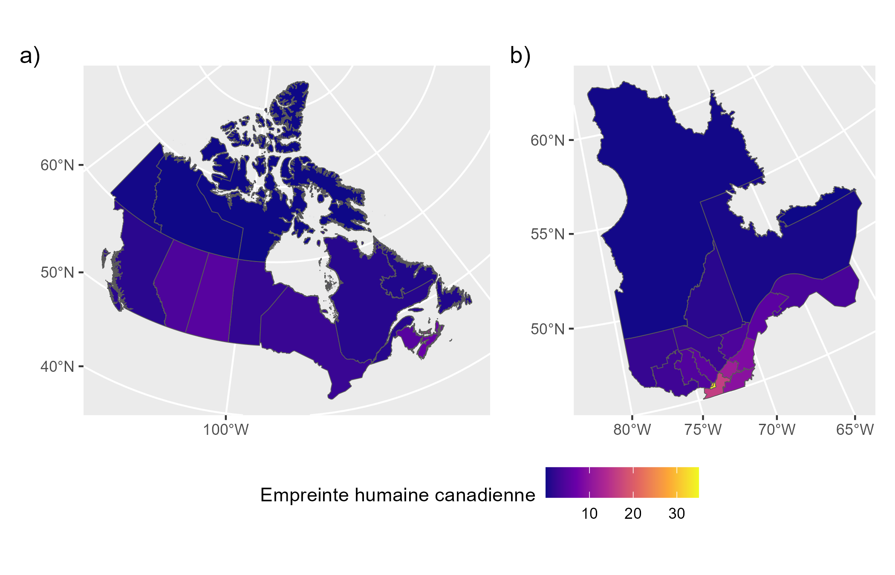

::: callout-warning
Ce chapitre est en cours de développement actif et n'est pas prêt à être utilisé pour la prise de décision.
:::

# Pressions sur la biodiversité {#sec-pressions-biodiv}

## Plan pour le chapitre

1.  Introduction avec perspective autochtone sur les pressions sur la biodiversité.

2.  Hiérarchie des pressions dans le monde versus au Québec et selon les contextes.

3.  Complexes et intéractions entre les moteurs de changement.

4.  Sommaire des moteurs de changement indirects.

5.  Empreinte humaine, Human Modification Index, Biodiversity Intactness Index, Forest Landscape Integrity, Habitat fragmentation metrics.

## Hiérarchie des pressions

Globalement, le principal moteur de changement en lien avec la perte de la biodiversité est le changement de l'utilisation des terres et des eaux, suivi de l'exploitation des ressources et de la pollution [@jaureguiberry2022].
Par contre, dans les Amériques, les importances relatives de l'utilisation des terres et eaux, l'exploitation des ressources, de la pollution, des changements climatiques et des espèces invasives ne sont pas significativement différentes [@jaureguiberry2022].
De plus, dans les océans ce sont l'exploitation directe et les changements climatiques qui sont les moteurs de changement dominants [@jaureguiberry2022].
La variable de biodiversité mesurée a aussi un impact sur la hiérarchie des moteurs de changement [@jaureguiberry2022].

Considérant que les contextes géographiques, et socio-écologiques sont importants pour l'hérarchisation des pressions sur la biodiversité, il est important de évaluer ces pressions sur les échelles du Québec, de ses éco-régions et régions administartives.

## Index d'empreinte humaine

L'index d'empreint humaine est une mesure agrégée qui permet d'estimer les moteurs de changements anthropiques sur le territoire [@hirsh-pearson2022].
Cette mesure, décrite en détail et calculée par @hirsh-pearson2022, inclut:

- l’étendue des zones bâties,
- des terres cultivées,
- des pâturages,
- la densité de population humaine,
- les lumières nocturnes,
- les voies ferrées,
- les routes,
- les voies navigables,
- les barrages et les réservoirs associés,
- les activités minières,
- le pétrole et le gaz,
- la foresterie.

Au Québec, la majorité du territoire a une empreinte humaine classifiée comme basse.
Par contre, plus on s'approche des zones urbanisées, plus que l'empreint humaine grandit.

::: column-page

:::

## Classifications des menaces

Par contre, différentes espèces et communautés sont affectés différemment par différentes activités humaines.
Par exemple, tandis que la perte d'habitat lié à l'urbanisation a un effet négatif sur les populations d'amphibiens, des espèces comme le pigeon biset (@fig-pigeon) s'y sont bien adaptés.
Il est donc pertinent de classifier les potentielles menaces à la biodiversité et de les étudier séparément.

{#fig-pigeon width="301"}

Au Québec, le Ministère de l'environnement, de la lutte contre les changements climatiques, de la faune et des parcs (MELCCFP) propose une typologie pour analyser les menaces à la biodiversité [@mffp2021classification]:

```{r classification_MELCCFP_level1}
#| results = 'asis'

library(yaml)
f= read_yaml(file = "typologie/MELCCFP_typologie.fr.yml")
level1 = c()
for(x in 1:11) level1 = c(level1, f[[1]]$categories[[x]]$nom)
paste( "-", level1, collapse = "\n") |> cat()
```

La classification du MELCCFP est en fait basé sur la Classification des menaces direct version 2.0 du Conservation Measures Partnership (CMP), un organisme qui développe aussi les Standards pour la pratique de la conservation.
La CMP a maintenant développée une version 4.0 de cette classification qui n'est pas encore traduite en français [@salafsky2024].
Voici le niveau 1 de la classification en anglais:

```{r}
library(stringr)
library(dplyr)
library(tidyr)
library(googlesheets4)
gs4_deauth()  # Read only public google sheet

classifV4 = read_sheet("https://docs.google.com/spreadsheets/d/1yfm7ua9hQJpjycx6FYQJ6Jy5LA4bP0XP61EW3-sX8ZY/edit?gid=310830663#gid=310830663", skip=2, sheet=2, ) |> 
  drop_na(L1) |> 
  pull(L1)

df = tibble(`Threat class` = c(), L1=c())

# class_type = NULL

for (r in classifV4) {
  if(str_detect(r, "^[A-Z]")) {
    class_type = str_sub(r, 4) 
  } else {
    df = df |> bind_rows(c(`Threat class` = class_type, L1 = str_sub(r, 4)))
  }
}

knitr::kable(df)
```
