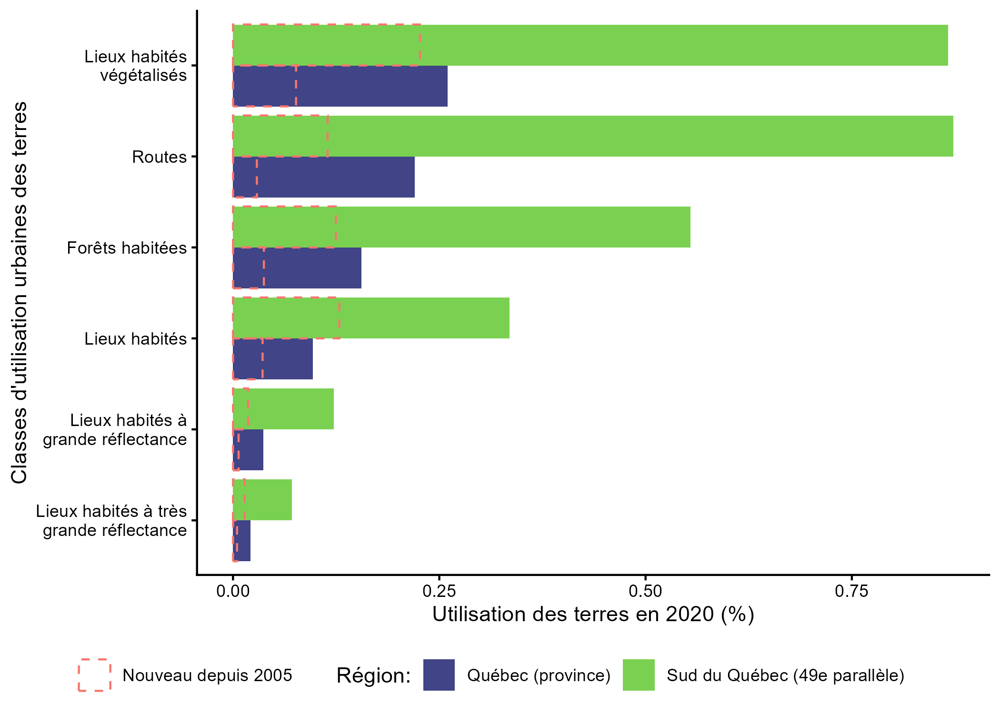
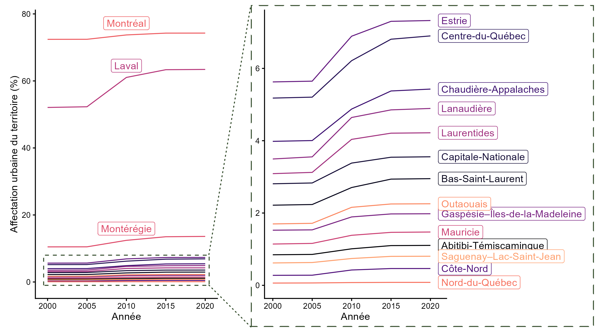

# Changement d'affectation des terres

::: callout-important
#### Constats principaux

- Une fois établies, les zones urbaines peuvent coexister avec et même promouvoir la biodiversité locale des plantes à proximité.

- L'effet des villes sur l’homogénéisation de la biodiversité chez les plantes à grande échelle reste un question ouverte.
:::

## Introduction

Cette catégorie de pressions inclut (@sec-pressions-biodiv):

- Développement commercial, résidentiel et récréatif

- Agriculture et aquaculture

- Production d'énergie et exploitation minière

- Transportation, services et corridors de sécurité

## Développement commercial, résidentiel et récréatif

Globalement, le développement commercial, résidentiel et récréatif (communément appelé urbanisation, développement urbain, ou étalement urbain dans la littérature de la science de la biodiversité) est associé avec la perte d'habitat, la baisse de la diversité des espèces, l’homogénéisation des communautés d'espèces et la présence d'espèces exotiques [@mcdonald2019].
Le développement urbain stimule aussi d'autres moteurs de changement tels que la consommation des ressources, la pollution, et le commerce.
Par contre, ces effets indirects sont moins bien étudiés [@mcdonald2019].
En moyenne, la densité de la population dans une ville est corrélée négativement avec la présence d'arbres et d'espaces verts [@mcdonald2023].
Néanmoins, peu importe la densité de la population, il existe souvent du potentiel pour augmenter la couverture boisée et d'espaces verts, ce qui permet d'augmenter la biodiversité et les contributions de la nature aux personnes [@mcdonald2023].

Au Canada, malgré les efforts de réconciliation avec les peuples autochtones, la planification urbaine a tendance à représenter les autochtones comme une partie de l'histoire, plutôt que de reconnaître les peuples et les revendications toujours présents sur le territoire [@ellis-young2025].
Au Québec, des communautés autochtones localisées près de grands centres urbains, tels que Kahnawà:ke et Kanehsatà:ke, ont participé aux efforts de résistance pour freiner le développement résidentiel et récréatif sur des territoires contestés végétalisés [@sims2022].

### Revue de littérature

Au Québec, plusieurs études portent sur les effets du développement résidentiel et commercial dans la grande région de Montréal, la Ville de Québec et Gatineau.

La grande majorité des études identifiées s’intéressaient aux espèces terrestres, mais une étude s'est penchée sur les communautés de zooplancton d'eau douce [@mimouni2018].

Le plus grand nombre d'études identifés se penchaient sur la diversité des plantes présentes près de, ou à l'inérieur des zones urbanisées.
Globalement, la présence de zones urbaines n'avait pas et d'impact significatif direct sur la biodiversité les différents types de plantes.
Bien entendu, ces études ne prennent pas en compte l'impact du développement urbain en soi, qui requiert souvent la destruction des plantes et de leur habitat.
Par contre, on voit qu'une fois établi, les zones urbaines peuvent exister en harmonie, et même parfois stimuler la biodiversité.

| Citation | Région géographique | Type d'espèces | Variable essentielle de la biodivesité | Impact direct du développement urbaine (positif on négatif) |
|---------------|---|-----------------------|------------------------------|---|
| @blouin2018, @blouin2019 | Grand Montréal et Québec | Plantes | diversité des taxonomique et diversité fonctionnelle | aucun |
| @brice2017 | Grand Montréal | Plantes (arbres riverains) | diversité des taxonomique (beta) | positif |
| @brice2016 | Grand Montéal | Plantes (arbres riverains) | diversité des traits | aucun |
| @brice2014 | Grand Montréal | Plantes (lianes) | abondance des communautés | positif |
| @loiselle2019 | Laval | Plantes (herbes et arbustres dans les zones humides) | diversité des taxonomique | aucun |

**Anuariens (grenouilles et crapauds)**

À Gatineau et Ottawa, il y a un impact négatif sur la diversité des espèces dans les zones urbaines, versus agricoles et en forêt.
[@gagné2006]

**Fourmis**

Les communautées de fourmis étaient plus nombreux et diversifiés dans des zones plus urbanisés que dans la forêt Molson, près de Montréal [@lessard2005]

**Papillons**

Échantillonage sur un gradient d'urbanisation revèle que l'urbanisation réduit la diversités des espèces et la diversité fonctionelle des papillons à Montréal [@rivest2024]

**Wild bees**

High species and functional diversity of wild bees in urban parks, community gardens and cemeteries in MTL, Qc city [@normandin2017].
Species diversity depends on diversity of flower morphologies [@sinno2024].
Negative impact of urban beekeeping on wild bee diversity [@macinnis2023].

**Chauve-souris**

À Montréal, l'absence de couverture forestière ou d'eau courante dans un échelle spatiale de 0.1 à 0.5 km a eu un effet négatif sur la diversité des espèces @fabianek2011.

**Birds**

@schillé2024 MTL bird diversity decreases with urbanization, but ecosystem service of predating insects depends on tree diversiy.

QC bird diversity decreases with urbanization [@clergeau1998]

**Outil de décision**

SylvCiT suggère des espèces d'arbres à planter pour maximizer la diversité fonctionelle à multiples échelles [@nicol2026].

Scénarios pour limiter l'étalement urbain autour de Montréal [@mosharafian2025]

**Zooplankton**

MTL - High species richness for zooplankton in urban waterbodies @mimouni2018

**Connectivité**

Le développement urbain, ensemble avec l'agriculture et les routes diminuent la connectivité pour certaines espèces [@mitchell2015; @dupras2016; @dupras2014].
\[À déplacer vers un module sur la connectivité\].

#### Méthode (littérature)

Pour identifier les articles, j'ai les recherches suivantes sur [Asta](https://asta.allen.ai/chat):

- `effects of residential and commercial development (urbanization) on biodiversity (genetic composition or species populations or species traits or community composition, or ecosystem structure or ecosystem function) or nature's contribution or ecosystem services in Quebec, Canada`

- `effects of urbanization on quebec biodiversity`

- `effects of residential and commercial development (aka urbanization) on nature's contribution or ecosystem services in Quebec, Canada`

À partir des les articles identifiés par Asta comme des "perfect match", j'ai sélectionné des articles revus par les pairs qui analysent réellement les effets du développement résidentiel, commercial ou récréatif sur la biodiversité au Québec.
Pour les articles sélectionnés, j'ai identifié le groupe taxonomique focal, la localisation géographique et l'impact du développement ou de la forme du développement sur la biodiversité et les contributions de la nature aux personnes.

```{r}
box::use(./R/land_use_aafc[get_aafc_classes])

qc = readr::read_csv("Out/summary_qc_zonal_and_summary_land_use.csv") |>
  dplyr::filter(qc_region == "Québec (province)")

qc_sud = readr::read_csv("Out/summary_sud_qc_land_use.csv")

get_urban_percent_area = function(df, yr=2020, round=3) {
  out = df |> 
    dplyr::filter(year == yr) |>
    dplyr::select(get_aafc_classes("Settlement")) |>
    as.matrix() |>
    sum(na.rm=T)
  
  round(out*100, round)
}
```

## Analyse des données disponibles

Les zones urbaines, en date de 2020, occupent `r get_urban_percent_area(qc)` % du territoire terrestre selon notre analyse de la classification de l'utilisation des terres de Agriculture et Agroalimentaire Canada [@aafc_land_use_2021].
Cet estimé inclut toutes les catégories de la @fig-qc-breakdown.
Les zones urbanisés représentent un continuum, entre des zones majoritairement végétalisés, comme des forêts habités (définis comme une couverture majoritairement de canopée d'arbres) et les lieux habités à très grande réflectence tels que des bâtiments et autres surfaces sans végétation observable [voir @nte-urban].
On voit que pour toutes les catégories, l'urbanisation est plus élevée dans le sud du Québec, représentant `r get_urban_percent_area(qc_sud)` % du territoire terrestre [@fig-qc-breakdown].
Niveau d'incertitude: moyen.

::: panel-tabset
### Figure

{#fig-qc-breakdown}

### Données

```{r}
# label: tbl-urban-breakdown
# tbl-cap: Utilisations des terres (%) par classe définie par Agriculture et Agroalimentaire Canada.

df = readr::read_csv("Out/table_qc_urban_breakdown.fr.csv") 
var = names(df)[2]
df |> dplyr::arrange(.data[[var]]) |>
  knitr::kable(digits=3)
```
:::

::: {#nte-urban .callout-note}
### Classifier l'utilisation des terres–Enjeux

Il existe plusieurs méthodes pour mesurer l'étendue des zone urbaines ce qui peut générer des différence d'un facteur de 10 pour les estimés d'aire urbanisé à l'échelle globale [@potere2007].
Cet grand écart entre les estimés est causé par des définitions variables de ce qui représente une utilisation urbaine (par exemple: est-ce que les arbres urbains devraient être classifiées comme une utilisation urbaine ou pas?) et des différences de résolution utilisés par différents produits cartographiques [@chakraborty2024].
Vous pouvez comparer les résultats de sept différentes modèles utilisées pour estimer la couverture urbaine avec une application développée par @chakraborty2024 au: <https://ee-tc25.projects.earthengine.app/view/urbancomparison> et utiliser le produit qui correspond le mieux à vos besoins.
La méthodologie exacte de la classification des terres d'Agriculture et Agroalimentaire Canada n'est pas rendue publique, elle tire des données de la base de données ESRI Land Cover 2020 pour les lieux habités.
Selon @chakraborty2024, ESRI Land Cover 2020, représente la limite supérieur des estimés de proportion d'une utilisation urbaine du territoire.
:::

### Changement de l'utilisation des terres

```{r}
get_perc_urb_incr = function(df, yr1=2000, yr2=2020, digits=1) {
  df_urb = df |> 
    dplyr::group_by(year) |> 
    dplyr::select(get_aafc_classes()) |>
    dplyr::summarise(urb_frac = sum(dplyr::across(dplyr::where(is.numeric)), na.rm=T))
  
  get_frac = function(yr) {
    df_urb |> dplyr::filter(year == yr) |> dplyr::pull(urb_frac)
  }
  perc_incr = 100*(get_frac(yr2)/get_frac(yr1) - 1)
  round(perc_incr, digits)
}
```

Au Québec la superficie de territoire urbanisé a augmenté de `r get_perc_urb_incr(qc)` % entre 2000 et 2020 (@fig-urbanisation).
Dans le sud du Québec (49e parallèle), l'augmentation est de `r get_perc_urb_incr(qc_sud)`.
À travers le régions administratives du Québec, le rythme d'urbanisation a augmenté surtout 2005 et 2015 [@fig-urbanisation].

{#fig-urbanisation}

## Routes

@bélanger2020
