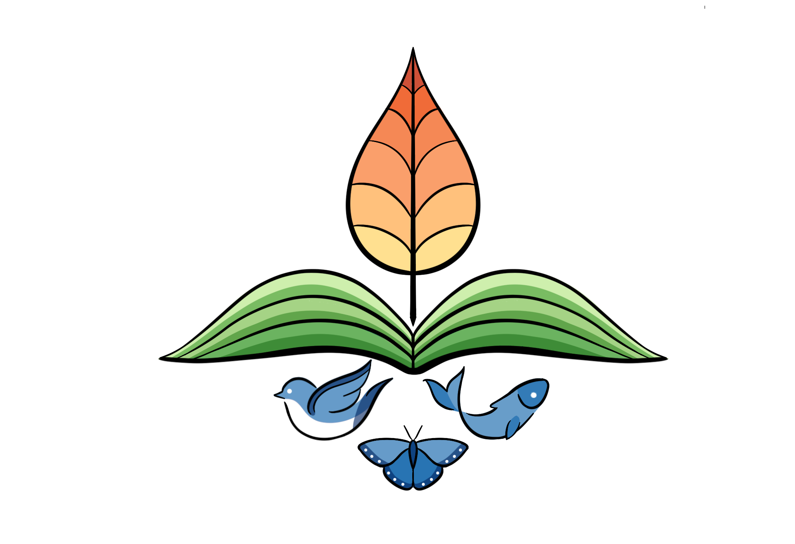

# Home {.unnumbered}

This website is a draft for a digital book that will eventually contain Quebec’s assessment of biodiversity and nature’s contributions to communities.

The project’s goal is to synthesize knowledge related to biodiversity, its changes, and its contributions to populations in Quebec in a scientifically credible and intellectually independent manner from the provincial government[^index.en-1]. This synthesis may be used to inform decisions that could impact biodiversity, guide biodiversity research, and inform the public in Quebec.

[^index.en-1]: Here we refer to intellectual independence because employees of the Quebec government and scientists funded by the Fonds de recherche du Québec are welcome to participate. However, the government itself will have no control over the content of this book or the conclusions of the assessment.

If you would like to contribute to the project, please feel free to email [rapport\@qcbs.ca](mailto:rapport@qcbs.ca) and consult the @sec-guide-contribution.

Unless otherwise specified, the content of this book is licensed under the [CC-BY 4.0 license](https://creativecommons.org/licenses/by/4.0/CC).

This project is led by the [Quebec Center for Biodiversity Science](https://qcbs.ca/) with support from [Biodiversité Québec](https://biodiversite-quebec.ca).

