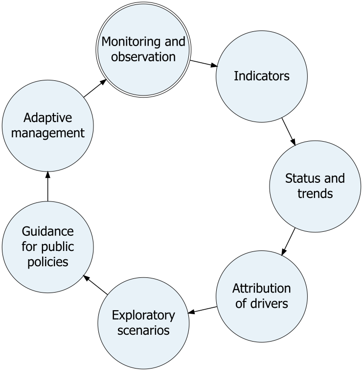
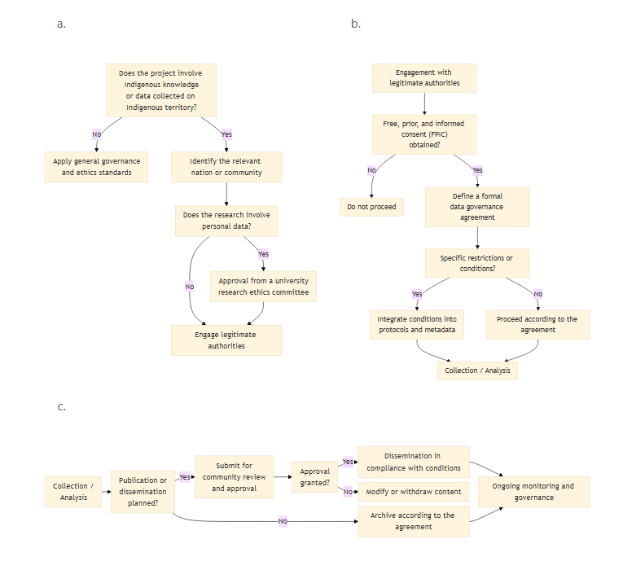

::: callout-caution
The contents of this chapter is subject to change.
:::

::: callout-tip
A summary of the content of this document was presented in the context of an unveiling webinar.
The recording (in French, slides in English) is available [here, on the QCBS YouTube channel](https://youtu.be/kyzUP54cMUk).
:::

# Scoping Document {#sec-scoping}



## Background and Objectives

### Background and Rationale

The accelerated decline in biodiversity represents a critical challenge at the provincial, national, and global levels.
Through the Kunming–Montreal Global Biodiversity Framework and the Nature 2030 Plan, Quebec has committed to strengthening the conservation, restoration, and monitoring of ecosystems.
The production of a **rigorous, evolving, and open-access report on the state of biodiversity in Quebec** is an essential tool for:

- Support evidence-based decision-making
- Measuring the progress of our biodiversity conservation efforts
- Inform citizens, the media, and organizations about changes in biodiversity
- Highlight the importance of nature’s contribution to the people of Quebec
- Helping mitigate current and anticipated threats to biodiversity
- Positioning the QCBS as a center of expertise and a leading authority

This framework document outlines the scope of the project and provides a roadmap for it.

### Definitions {#sec-def}

**Biodiversity**: the diversity of life on Earth.
This multifaceted diversity can be measured by [essential biodiversity variables (EBVs)](https://geobon.org/ebvs/what-are-ebvs/), including the diversity of:

- genes (genetic diversity and differentiation, effective population size, inbreeding),
- ecosystem functions (primary productivity, phenology, and disturbances),
- ecosystem structures (fraction of living cover, distribution, vertical profile),
- species populations (their distribution and abundance),
- species traits (morphology, physiology, phenology, reproduction, movement),
- community composition (abundance, and taxonomic, phylogenetic, trait, and interaction diversity).

**Nature’s contributions to people**: the positive and negative contributions that living nature (diversity of organisms, ecosystems, and the associated ecological and evolutionary processes) provides to human quality of life.
Furthermore refers to a framework used by the International Panel on Biodiversity and Ecosystem Services and aims to study these contributions through the lens of different cultural contexts [@díaz2018; @ipbes2019] .

**Driver of change**: factors that cause, directly or indirectly, changes in the natural and human-made environment, nature’s contributions to people, and quality of life.

**Lever for change**: strategic interventions with significant potential to drive changes in biodiversity and nature’s contribution to people.

### Goal and Objectives

The main goal of the project is to produce a **modular, evolving, and scientifically robust** evidence base on biodiversity in Quebec, integrating data, indicators, scientific literature, expert opinions, local and Indigenous knowledge, drivers of change, essential variables (EBVs), nature’s contributions to people, status, trends, projections, scenarios, and recommendations tailored to Quebec decision-makers.

#### Planning

In this document, the objectives are as follows:

- Establish **clear and credible governance**
- Establish a clear **methodological framework** that will guide authors in preparing the report and enable effective communication with target audiences (e.g., criteria for scientific evidence)
- Plan for **independent scientific validation**
- Provide a framework that allows for a **modular structure** enabling the gradual publication of chapters and their respective authors.

#### Report

The objectives of the report will be:

- To establish a **Quebec-specific overview** of drivers of change, biodiversity, and nature’s contributions to populations
- Identify **major gaps** in available data and studies to determine research needs
- Gradually integrate new data and dimensions into the report
- Develop **scenarios** for projections
- Support **decision-making** by the various stakeholders in nature management within our society (in accordance with the IPBES vision [@IPBESassesment] )

#### Executive Summaries

The findings of the assessment will be supplemented by executive summaries designed to:

- **summarize the current state of knowledge** to inform strategic decisions regarding monitoring and conservation networks;
- **identify the main drivers of change** affecting biodiversity, in order to target public interventions;
- **propose synergistic levers for change** that would simultaneously maximize positive effects on multiple aspects of biodiversity and nature’s contribution to people;
- **support decision-making**, particularly in the fields of conservation, forestry, agriculture, land management, and spatial planning;
- **provide a common scientific basis** to facilitate coordination among ministries, government agencies, and other stakeholders.

#### Contribution to the Nature Plan Monitoring Framework

The assessment will also help support the monitoring framework for the Nature Plan 2030 by:

- consolidating and synthesizing the information needed to **monitor biodiversity indicators** (Objective 9.2 of the 2024–2028 Action Plan; @MELCCFP2024PlanNatureAction).
- identifying **gaps in data and monitoring networks** (Target 9 of the Nature Plan 2030; @MELCCFP2024PlanNature2030);
- proposing **complementary indicators and assessment approaches** where relevant (in accordance with “Note 2” of the 2024–2028 Action Plan; @MELCCFP2024PlanNatureAction);
- providing an integrated analysis that allows for the interpretation of indicators within a broader ecological and socio-ecological context.

Thus, the report and executive summaries aim not only to provide an overview of the current state of scientific knowledge but also to **strengthen the science-policy interface** and support evidence-based decision-making for the conservation and sustainable use of biodiversity in Quebec.

#### Benefits for Research at the QCBS and Beyond

This project also aims to generate benefits for the QCBS and biodiversity research:

- Contribute to the overall **mission of the QCBS**: “to enhance Quebec’s capacity to monitor and predict the state of its biodiversity and ecosystems in order to make informed decisions, both for the management of the province’s biodiversity and to fulfill its international commitments in this area.”
- **Mobilize the QCBS** **community** around an integrative project through collaboration within working groups.
- **Create new connections** between QCBS members and other stakeholders working in the field of biodiversity in Quebec.
- Identify **research gaps** needsto help guide the efforts of QCBS researchers (and others).
- Contribute to the **training of QCBS** **students**.
- **Promote the visibility** of the QCBS and biodiversity.

## Methodological Framework

The report will draw on open data, closed data (e.g., data available only within the government), scientific literature, expert opinions, and local and Indigenous knowledge.

### Geographic Scope

The scope of the project will be limited to the territory of Quebec, including terrestrial, marine, and freshwater environments.
Note that the methodology for certain modules may involve the use of data from beyond Quebec’s borders, for example, to model the distributions of species migrating from the United States in response to climate change.
In terms of spatial scale, the objective is to achieve the highest possible resolution, taking into account technical limitations and available data.

### Work Cycle

This assessment aims to strengthen biodiversity governance in Quebec by supporting a continuous cycle of knowledge production and application for public action.
It is part of an adaptive management approach, structured around an information and decision-making cycle inspired by the [research priorities of the Quebec Centre for Biodiversity Science (QCBS)](https://qcbs.ca/overview/):

{#fig-work-cycle fig-alt="Monitoring and observation → Indicators → Status and trends → Attribution of drivers → Exploratory scenarios → Guidance for public policies → Adaptive management → Back to monitoring and observation" width="2.94in"}

In this work cycle [@fig-work-cycle]:

- **Monitoring and observation** provide empirical data from surveillance networks, research programs, and citizen science initiatives.
- **Indicators** translate this data into summary measures that allow for the assessment of the state of biodiversity and its changes.
- **Analysis of status and trends** documents the changes observed in various aspects of biodiversity [@sec-def] .
- **Attribution** aims to identify the drivers responsible for these changes.
- **Prospective scenarios** explore possible trajectories for biodiversity based on different management and public policy choices.
- **Public policy recommendations** translate these analyses into information useful for decision-making.
- **Adaptive management** then allows for the adjustment of interventions and policies, based on new observations and monitoring data.

### General Principles

The assessment is based on four guiding principles:

1.  Scientific rigor and transparency
    - All analyses must be reproducible, documented, and supported by traceable data.
2.  Multi-level approach to biodiversity
    - The assessment covers the genetic, population, species, community, and ecosystem structure and function levels, as well as nature’s contributions to people (NCP).
3.  Integration of drivers of change
    - The assessment does not merely describe the current state; it also analyzes trends, likely causes, and future scenarios.
4.  Consistent modularity
    - Each chapter follows a common structure to ensure comparability and cross-cutting integration.

### General analytical framework

The assessment is organized around five analytical components:

1.  Current state
2.  Temporal trends
3.  Drivers and attribution
4.  Projections and Scenarios
5.  Uncertainties and gaps

Each working group must explicitly address these five components.

### Definition and assessment of the current state

#### Definition

**The status** corresponds to the current condition of a driver of change, a biodiversity component, or NCP, as measured by one or more quantitative indicators.

#### Reference types

Where possible, the status will be assessed against:

- A historical baseline (e.g., 1970, 1990, or the pre-industrial period, where applicable)
- A policy target (Nature Plan 2030, Global Biodiversity Framework targets)
- A documented ecological or biological threshold
- A spatial reference condition (comparison between regions)

The chosen reference must be explicitly justified.

#### Spatial resolution

Indicators must be produced at the finest resolution compatible with the available data, while allowing for aggregation at the following scales:

- Ecozones
- Watersheds
- Administrative regions
- Entire province

The spatial boundaries used must be harmonized across chapters whenever possible.

### Analysis of temporal trends

#### Minimum requirements

A trend analysis requires:

- An explicit time series
- A description of the sampling effort
- A statistical method suited to the data structure

#### Possible analytical methods

Depending on the type of data:

- Linear or generalized models
- Hierarchical mixed models
- Occupancy models
- Capture-mark-recapture
- State-space models
- Bayesian time series
- Composite indices

Methodological choices must be justified and documented.

#### Detection and statistical power

Where relevant, working groups must:

- Estimate the ability to detect a change (statistical power)
- Identify limitations related to the duration or quality of the time series

### Analysis of drivers of change and attribution

Attribution aims to determine whether observed changes can be linked to identifiable drivers.

#### Categories of drivers of change

The categorization of drivers of change follows the MELCCFP threat typology [@mffp2021classification] .

- Residential and commercial development
- Agriculture and aquaculture
- Energy production and mining
- Transportation corridors and services
- Exploitation of biological resources
- Human intrusions and disturbances
- Changes to natural systems
- Invasive or problematic species, genes, and pathogens
- Pollution
- Geological events
- Climate change and severe weather

#### Attribution approaches

- Multivariate statistical models
- Spatial comparisons (contrasting areas)
- Correlation analyses with environmental variables
- Natural experiments
- Mechanistic approaches, when available

Attribution conclusions must specify:

- The level of confidence
- Analytical limitations
- Underlying assumptions

### Nature’s Contributions to People (NCP)

The assessment includes the material, regulatory, and non-material contributions of nature.

For each NCP analyzed:

- Describe the link to biodiversity
- Identify biophysical indicators
- Incorporate social or economic data where possible
- Identify spatial or social inequalities

### Projections and Future Scenarios

#### Objective

To explore plausible future trajectories under different environmental or political scenarios.

#### Types of Scenarios

- Climate scenarios (e.g., SSP/RCP)
- Land-use scenarios
- Combined scenarios
- Scenarios for meeting or failing to meet the Nature Plan targets

#### Important distinction

The chapters must clearly distinguish between:

- Exploratory projections
- Simulations linked to policy targets
- Normative scenarios

### Integration of Indigenous and local knowledge

The integration of Indigenous and local knowledge must:

- Comply with data governance principles (CARE and FAIR; see @sec-protocole-connaissances-locales)
- Be based on prior and informed consent
- Recognize intellectual property
- Document the integration procedures.

This knowledge can contribute to:

- Identifying trends,
- Historical contextualization,
- Interpreting changes.

### Confidence Level Classification

Each conclusion must be accompanied by a qualitative assessment supported by expertise and verified during the review process [@sec-revision] :

1.  Strength of data (low / moderate / high)
2.  Consistency among sources (low / moderate / high)
3.  Spatial and temporal coverage

This approach aims to make the information more credible and accessible to decision-makers.

### Uncertainty management

Uncertainties must be explicitly documented:

- Data-related uncertainties
- Methodological uncertainties
- Uncertainties related to scenarios
- Geographic areas with insufficient data

Where possible, confidence intervals or probability distributions should be provided.

### Data and reproducibility

#### Data sources

Data may include:

- Open data (e.g., GBIF, remote sensing)
- Government data
- Data from monitoring programs
- Scientific literature
- Local and Indigenous knowledge

Each chapter must include:

- A description of the sources
- Relevant metadata
- Limitations on use

#### Reproducibility

Analyses must be:

- Documented using reproducible scripts
- Versioned (e.g., tracking changes using Git)
- Archived in an institutional repository whenever possible

See @sec-flux-repr for more details on the workflow.

### Publication formats

- **Dynamic website** (with text, graphics, and interactive dashboards)
- Divided into chapters
- Easy to update
- Internal links and references
- Static and interactive visualizations
- Bilingual format (English and French)
- Option for interactive comments
- **Exportable PDF** by chapter
- Same content as the website, but without interactive elements
- Web and PDF **executive summaries**, short and accessible by chapter
- Summary infographics
- Short videos

### Technologies used {#sec-tech}

To ensure accessibility for researchers while allowing for easy integration with multiple output formats (HTML, PDF), the website will be built using [Quarto](https://quarto.org/).
Researchers will write their content in [Markdown](https://www.markdownguide.org/) format,which is lightweight and easy to understand and includes images, code (executable or not), and references (internal and external).
Software such as Posit’s RStudio includes a visual editing mode to make Quarto easier for beginners to adopt.

- The plain-text formatting used by Quarto will enable version history tracking and efficient collaboration with [Git](https://git-scm.com/) and [GitHub](https://github.com/).
- Interactive dashboards can be created with [R Shiny](https://shiny.posit.co/) and implemented [directly within Quarto files](https://quarto.org/docs/interactive/shiny/).
- Including code directly, or references to updated files, within Quarto files will ensure the reproducibility of calculations and analyses and facilitate updates.
- Training sessions will be offered by the support team to guide QCBS students and researchers in using these tools.
- Quarto files can be rendered directly as a website in book format, using a [Quarto theme tailored to the report](https://quarto.org/docs/output-formats/html-themes.html), or rendered in Markdown format to be integrated into [a Hugo website](https://gohugo.io/).
- The integration of tools such as\<Hypothes.is\>will allow committee members and the public to provide annotations to the website, truly bringing it to life. Note that moderation will be required if the ability to leave comments is opened to the public.
- English-to-French translation can be assisted by the paid version of the [DeepL](https://www.deepl.com/en/translator) artificial intelligence tool(the free version is not approved for [use at McGill](https://www.mcgill.ca/linguistic-services/language-resources/ai-translation-guide)) and [the babeldown software package](https://docs.ropensci.org/babeldown/). However, the translation must be reviewed by a human.
- If Quarto is used directly to generate the website, [babelquarto](https://docs.ropensci.org/babelquarto/) can be used to generate a bilingual website. If Hugo is used, [the multilingual mode](https://gohugo.io/content-management/multilingual/) must be enabled.
- The generated website will be entirely in HTML, CSS, and JavaScript and can therefore be hosted on most servers available on the web.

#### Collaborative and reproducible workflow {#sec-flux-repr}

Multiple working groups will collaborate on a single chapter [@sec-wg].
Using the branching feature of the `git` software will allow different working groups to work independently on their respective tasks [@sec-tech].
Then, a designated member of the support team will be responsible for merging the branches of the different working groups into the common trunk as tasks are completed.

To avoid making a Quarto chapter overly cumbersome, all modeling and graphics must be done outside the Quarto file, using a dedicated script.
The outputs can then be directly referenced within the Quarto document.
This will ensure that each working group only needs to use the technological tools necessary for their work and will not need to perform the analyses of their colleagues in other working groups.

A layer for organizing folders:

```{r}
library(fs)
dir_create("temp-dirs")
setwd("temp-dirs")
dir <- path("Rapport-Biodiv-QC")
dir_create(dir, "Chap1")
file_create(dir, "Chap1/01-Contexte.qmd")
dir_create(dir, "Chap3/wg-genes")
dir_create(dir, "Chap3/wg-especes")
dir_create(dir, "Chap3/wg-especes/data/raw/")
dir_create(dir, "Chap3/wg-especes/data/tidy/")
dir_create(dir, "Chap3/wg-especes/analysis/")
dir_create(dir, "Chap3/wg-especes/out/")
dir_create(dir, "Chap3/wg-especes/fig/")
dir_create(dir, "Chap3/wg-traits")
file_create(dir, "Chap3/03-Nature.qmd")
file_create(dir, "Chap3/03-tableau-de-bord_.qmd")
dir_tree(dir)
dir_delete(dir)
setwd("..")

```

Each chapter is located in its own folder.
Under each chapter, there will be a Quarto file (`.qmd`).
Each working group working on a chapter will have its own folder containing subfolders with raw data (`data/raw`) and cleaneddata(`data/tidy`), their analyses (`data/analysis`), textual results (`data/raw`), and graphicalresults(`data/fig`).
Dashboards will be created from Quarto files independent of the main text but will be referenced in the main document.
Other interactive elements will be integrated directly into the main text document.
For each interactive element, a static version must be created for the PDF format (see [this discussion](https://github.com/orgs/quarto-dev/discussions/6665)).

### Proposed structure for the chapters

Each module or chapter must follow the following structure:

0.  Executive Summary
    - Key Messages
    - Gaps and Future Priorities
    - General Recommendations
1.  Introduction and Rationale
2.  Conceptual Framework
3.  Data Used
4.  Analytical Methods
5.  Results – Status
6.  Results – Trends
7.  Drivers and Attribution
8.  Uncertainties
9.  Implications for the Nature Plan and Other Frameworks
10. Research Gaps and Priorities

### Cross-cutting Synthesis

A synthesis team will ensure:

- Integration between genetic, species, and ecosystem dimensions
- Consistency between biodiversity and NCP
- Identification of contradictions or convergences
- Production of common summary graphics

### Methodological conclusion

This framework aims to ensure that the Quebec biodiversity assessment is:

- Scientifically sound
- Transparent
- Comparable over time
- Aligned with international frameworks
- Relevant for decision-making

It serves as the mandatory reference for all working groups.

## Governance structure

### Executive Committee (strategic direction)

**Role:**define priorities, make key decisions, oversee the project, and ensure its credibility

**Composition (indicative):**4–5 senior scientists

- Fanie Pelletier (QCBS, UdeS),
- Andrew Gonzalez (QCBS, McGill),
- Dominique Gravel (QCBS, Biodiversité Québec, UdeS),
- Guillaume Blanchet (QCBS, UdeS),
- Sara Teitelbaum (QCBS, UdeM)

### Support and Coordination Team

**Principal Coordinator**(QCBS) — operational management, timeline, deliverables, meeting follow-up.
For deliverables: create text summaries, ensure consistency in text and graphics.
Integrate the various chapters, identify gaps, and assist in finding individuals who can address these gaps.
Facilitate communication between the various committees and working groups.

- Egor Katkov (research professional at the QCBS).

**Coordinating Council** (QCBS) — provides scientific advice to the Executive Committee and technical support to the working groups and the lead coordinator.

- Guillaume Larocque (researcher at the QCBS),
- El-Amine Mimouni (research professional at the QCBS).

### Communications Committee

**Role:**

- Define communication strategies, speak with journalists, and ensure the QCBS’s visibility through the report.
- Propose a unified visual style

**Members**:

- Samuel Enright (QCBS communications officer)
- Fanie Pelletier
- Guillaume Blanchet
- Egor Katkov

### Scientific Co-Direction Committee

This committee will be open to all QCBS research members.

**Recruitment**: A general invitation will be sent via email.
Additionally, targeted invitations will be sent to recruit experts selected by the executive committee.

Role: Provide scientific, conceptual, methodological, and editorial leadership for the project.

### Advisory and Review Committee (Independent Validation)

**Role:** Assess scientific quality, impartiality, and social and political relevance

**Positions on the committee**

- Representatives from various Indigenous communities (2–3)
  - Representation from northern Quebec.
- Government representatives (2–3):
  - MELCCFP
  - Ministry of Natural Resources
- Representatives from the NGO sector (2–3)
- Representatives from the para-academic sector (museums, collections; 2–3)
- Representatives from provincial biodiversity reports:
  - ABMI (Alberta Biodiversity Monitoring Institute)
  - Ontario Biodiversity Council
- Representatives from various Quebec strategic groups working on biodiversity:
  - CEF (forestry sector),
  - CEN (northern sector),
  - SÈVE (agricultural sector),
  - Québec-Océan,
  - GRIL (freshwater).

### Thematic working groups {#sec-wg}

Each working group focuses on developing a chapter.

**Recruitment**: An email will be sent to QCBS members to recruit researchers and students to work on the various chapters of the report.Targeted emails may also be sent to experts in specific fields.

**Role:**produce the modules and chapters

**Composition:**researchers, students, sector experts, members of the support and coordination team.

**Examples of groups for a chapter (based on the EBV classification** [@kissling2018]**):**

- genetic composition
- species populations
- species traits
- community composition
- ecosystem structure
- ecosystem functioning

Most chapters will require a wide range of expertise from various thematic working groups.

**Working group functionning** [@fig-wg]: The working group will discuss what should be included in a chapter related to their theme, divide tasks among its members, and collaborate using the `git` program .
(See @sec-tech for more details on the technological aspects of collaboration).
Members of the support and coordination committee will participate in discussions to ensure the work does not exceed the scope of the chapter or report, to help identify gaps, and, if necessary, to find people who could help fill those gaps.
The support team will also provide the necessary training for using a writing system that ensures effective collaboration (GitHub) and a writing format compatible with a dynamic website or a static document (Quarto).

```{mermaid}
%%| label: fig-wg
%%| fig-cap: Mode de fonctionnement pour un groupe de travail thématique
%%| fig-height: 5
---
config:
  theme: base
---

flowchart TD
  A[Discuter du plan et assigner les tâches] --> B{"La portée du projet et du chapitre<br> est respecté?"}
  B -->|Non| A
  B -->|Oui| C{'Lacunes<br>identifiées?'}
  C -->|Non| D[Rédiger une ébauche]
  C -->|Oui| E[Inviter des collaborateurs supplémentaires]
  E --> A
  E --> D
  D --> F["Révision (voir section sur la révision)"]
```

When the review committee deems the chapter sufficiently informative and scientifically robust for publication, working group members may choose to continue working on developing:

1.  a subsequent chapter, or
2.  an update to a chapter.

### Decision-making hierarchy

**Scientific disagreements** within working groups may be brought before the scientific committee.
The Scientific Committee may, at its discretion, consult external members or the Advisory Committee to help resolve the disagreement.
A follow-up on the disagreement must be conducted by the support team and will be summarized in an appendix to the report or a footnote.

The **publication** of a chapter or module must be reviewed in detail by at least two members of the advisory committee and two members of the scientific committee, and finally approved by the executive committee.
In addition to the working group members, the members of the scientific committee will be responsible for ensuring that uncertainty levels are acceptable and clearly communicated prior to publication.

### Conflict of Interest Policy {#sec-conflit-interet}

A conflict of interest is a situation where the neutrality or objectivity of a person or institution involved in decision-making could be called into question.
For example, the contribution of a government employee of the to the section of the report concerning implementation could be considered a conflict of interest.

Conflicts of interest undermine the report’s credibility.
However, the number of experts in Quebec is limited, and it is inevitable that some individuals will have to wear multiple hats.
We must therefore balance access to expertise with the loss of credibility associated with conflicts of interest.

We require that all individuals complete a conflict of interest disclosure form before contributing to the report.
These disclosures may be revised throughout the writing process and will undergo the review process [@sec-revision] .
A disclosure excluding confidential information, such as financial amounts, will be published alongside the report.

To avoid excluding individuals with valuable expertise, conflict of interest mitigation measures will be proposed by the support team.
For example, a government employee may contribute to data collection but not to the analysis, conclusions, or recommendations.
The proposal may then be amended and must be approved by the executive committee.
If the conflict of interest involves a member of the executive committee, a conflict of interest subcommittee within the advisory committee will be established to assess the case.

### Protocol for the Governance of Indigenous and Local Knowledge {#sec-protocole-connaissances-locales}

The QCBS recognizes that Indigenous Nations and communities hold **rights** regarding Indigenous knowledge and data collected on their territories.
This protocol is grounded in the sovereignty of Indigenous data and incorporates the principles of FPIC (Free, Prior, and Informed Consent), CARE (Collective Benefit, Control, Accountability, and Ethics; @jennings2023), and, where relevant and appropriate, FAIR (Findable, Accessible, Interoperable, and Reusable; @wilkinson2016).

#### Consent and Authority

Any use of Indigenous knowledge is subject to free, prior, and informed consent (FPIC) obtained in accordance with the legitimate decision-making structures of the Nation concerned.

Consent:

- Must be obtained prior to any collection, analysis, or dissemination.
- Is an ongoing and revisable process.
- May include partial or complete restrictions.
- May be withdrawn in accordance with agreed-upon terms.

Communities retain ongoing control over the use, dissemination, archiving, and reuse of data, including in digital environments.

#### Data Governance and Sovereignty

The QCBS recognizes the sovereignty of Indigenous data, including the authority of Indigenous nations to:

- Determine the conditions of access and use.
- Regulate public or restricted dissemination.
- Authorize or deny secondary reuse.
- Define the terms for archiving or removal.

When data management standards are applied (for example, the FAIR principles), these may under no circumstances take precedence over the rights and protocols defined by communities in accordance with the CARE principles.

#### Attribution, provenance, and intellectual property

The provenance of knowledge must be rigorously documented.

Metadata must:

- Clearly identify the rights holders.
- Indicate the terms of use.
- Reflect applicable community protocols.

Any publication or dissemination:

- Is subject to review and approval by the relevant communities.
- Must comply with the agreed attribution terms.
- Must explicitly acknowledge Indigenous contributions, including where relevant in terms of authorship or intellectual property.

#### Community Benefits and Reciprocity

Objectives and benefits must be jointly defined with the communities.

The process must:

- Maximize collective benefits.
- Support local capacity building.
- Value and, where appropriate, compensate for Indigenous expertise.
- Avoid any extractive dynamics.

Deliverables must be accessible in appropriate formats, languages, and modalities.

#### Ethics and Review Mechanisms

The QCBS commits to:

- Respecting the ethical frameworks specific to the nations concerned.
- Recognize power imbalances and historical contexts.
- Assess and minimize potential negative impacts.

When required, activities involving Indigenous knowledge must be submitted (@fig-ethic):

- To applicable community review or approval mechanisms.
- To a research ethics committee at a Quebec academic institution (e.g., McGill University’s Research Ethics Board).

Compliance with established agreements is tracked and documented.

{#fig-ethic}

### Review Process {#sec-revision}

With the advice of the support team, the executive committee will be responsible for initiating the review process for a chapter.

**Step 1: Internal Review**

The chapter is reviewed in detail by at least two members of the scientific committee.
Comments are sent to the support team, which forwards them directly or brings them to the relevant working group.
This process is repeated until the members of the scientific committee are satisfied.

**Step 2: External Scientific Review**

At least 60% of the members of the advisory committee must review the document and send a brief evaluation and, if necessary, comments to the support team.
The support team forwards the comments or presents them to the relevant working group.

The advisory committee may request that additional independent experts be involved in the review process.

All changes must undergo internal review (Step 1), but do not need to be re-evaluated by the advisory committee.

**Step 3: Government Review (Limited)**

Representatives from MELCCFP will review only the executive summaries and will not have scientific editing privileges.
Their comments will be forwarded by the support team or the relevant working group.
Changes will then be submitted for internal review (Step 1).

#### Transparency

Comments provided during all review processes will be recorded as GitHub issues and linked to the corresponding changes in the version history.

#### Review of Updates

The review process must be proportional to the change’s impact on the message.

```{mermaid}
%%| label: fig-update
%%| fig-cap: Procedure for making updates to the report
%%| fig-height: 5
---
config:
  theme: base
---

flowchart TD
  A{"What type of update is this?"}
  A --> |"Addition of a new module or a section within a module"| C["Internal and external review"]
  A --> |"Update to methodology or data"| G{Are the conclusions affected?}
  G --> |Yes| C
  G --> |No| H["Internal review"]
  A --> |"Minor correction (clarifications, definitions, wording, or spelling)"| H
```

### Reuse and Attribution

Where possible, text and data generated in the system will be licensed under [CC-BY](https://creativecommons.org/licenses/by/4.0/deed.fr).
This license allows for the sharing and adaptation of the material provided that the authors of the original work are credited.

Where possible, the source code used for analyses and layout will be licensed under the [MIT](https://opensource.org/license/MIT) License.

## Communication Strategy

### Target Audiences

- Researchers
- Public decision-makers
- NGOs and practitioners
- Journalists
- General public

### Strategies

- Launches by chapter
- Layman's summaries
- Partnerships with communication experts
- Review of messages by interdisciplinary experts or in partnership with target audiences (decision-makers, NGOs, journalists, students) to assess social and political relevance

### Derivative products

- Infographics
- Web clips
- Public presentations

## Indicative timeline (@fig-echeancier) {#sec-échéancier}

### Phase 1 — Scoping (January–April 2026)

- Webinar to present a draft of the scoping document to the QCBS
- Establishment of committees
- Approval of the table of contents

**Deliverables**:

- Finalization of the scope document
- Launch communication plan
- Press release 

### Phase 2 — Initial rollout (summer and fall 2026)

- Launch of the first working groups
- Communication plan for the initial rollout
- Release of the first pilot modules.

**Deliverables**:

- Prototype for the web architecture
- Pilot module 1 (e.g., human footprint)
- Pilot module 2 (e.g., genetic diversity)
- Visual identity guide
- Data management protocol
- (Press release)

### Phase 3 — Consolidation (2027)

- Integration of new chapters.
- Publication of the **consolidated Version 1**

**Deliverables:**

- Summary of status and trends, including:
  - Status of natural components
    - First interactive dashboards
  - Drivers of change and attribution of changes
  - Nature’s contribution to populations
- Summary report on uncertainties
- Press release 

### Phase 4 — Ongoing Updates (Winter 2028)

**Deliverables**:

- Version 1 of the consolidated report
- Executive summary
- Technical appendix
- Public data repository
- Reproducible code repository
- Press release

**Critical deadline:** FRQ evaluation in March 2028.

```{mermaid}
%%| fig-cap: Initial timeline for the Quebec biodiversity assessment
%%| label: fig-echeancier
%%| column: page

---
config:
  theme: base
  gantt:
    fontSize: 14
    sectionFontSize: 14
  themeCSS: |
    .today {
      stroke: #ff4500 !important;
      stroke-width: 1px !important;
      stroke-dasharray: 8,4 !important;
    }
    .tick text {
      font-size: 14px; /* Adjust the size as needed */
    }
---

gantt
    title Indicative timeline
    dateFormat  YYYY-MM-DD
    axisFormat  %b %Y

    %% =========================
    section Phase 1 — <br /> Scoping <br /> (Jan–Mar 2026)
    Establishment of committees               :p1a, 2026-01-01, 2026-03-31
    Validation of table of contents           :p1b, after p1a, 20d
    QCBS webinar (draft scoping)               :p1w, 2026-03-25, 5d

    Finalization of scoping document           :p1c, 2026-02-01, 2026-04-20
    Communication plan for launch              :p1d, 2026-02-15, 2026-04-15
    Press release                              :milestone, 2026-04-30, 1d

    %% =========================
    section Phase 2 — <br /> Initial deployment <br /> (Summer–Fall 2026)
    Launch of working groups                   :p2a, 2026-02-01, 2026-07-15
    Communication plan                         :p2b, 2026-06-01, 2026-09-01

    Data governance protocol                   :p2e, 2026-04-01, 2026-06-15
    Web architecture prototype                 :p2c, 2026-05-01, 2026-09-01
    Visual identity guidelines                 :p2d, 2026-05-01, 2026-09-01

    Pilot module 1 — Human footprint           :p2f, 2026-09-01, 2026-11-15
    Pilot module 2 — Genetic diversity         :p2g, 2026-02-12, 2026-11-30
    Publication of pilot modules               :milestone, 2026-11-30, 1d
    Press release                              :milestone, 2026-12-05, 1d

    %% =========================
    section Phase 3 — Consolidation (2027)
    Integration of new chapters                :p3a, 2027-01-01, 2027-12-01

    State and trends synthesis                 :p3b, 2027-01-01, 2027-09-01
    Nature’s contributions to people           :p3c, 2027-02-01, 2027-10-01
    Drivers of change and attribution          :p3d, 2027-03-01, 2027-11-01
    Interactive dashboards                     :p3e, 2027-06-01, 2027-12-15
    Uncertainty synthesis report               :p3f, 2027-09-01, 2027-12-15

    Consolidated version 1                     :milestone, 2027-12-20, 1d
    Press release                              :milestone, 2028-01-10, 1d

    %% =========================
    section Phase 4 — Continuous updates (Winter 2028)
    Version 1 consolidated report (final format):p4a, 2028-01-05, 2028-02-15
    Executive summary                          :p4b, 2028-01-10, 2028-02-15
    Technical appendix                         :p4c, 2028-01-10, 2028-02-28
    Public data repository                     :p4d, 2028-02-01, 2028-03-15
    Reproducible code repository               :p4e, 2028-02-01, 2028-03-15
    Press release                              :milestone, 2028-02-20, 1d

    FRQ evaluation                             :crit, milestone, 2028-03-31, 1d
```

## Success and Risk Factors

### Success Factors

- Clear leadership
- Actual delivery capacity
- Commitment from CSBQ members
- Invlovment of researchers from across Québec
- Modularity (avoid a monolithic report)
- Scientific rigor + social relevance

### Risk Factors

- Data gaps in marine and freshwater systems
- Spatial bias toward southern Quebec
- Uneven temporal coverage
- Political sensitivity of the results

## Next immediate steps

1.  Approve this document with the executive committee
2.  Appoint committee members
3.  Launch pilot working groups
4.  Define the report’s web architecture

## Reuse {.appendix}

This document is licensed under [CC-BY](https://creativecommons.org/licenses/by/4.0/deed.en).

{width="241"}
