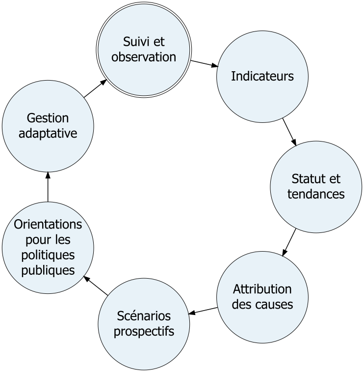
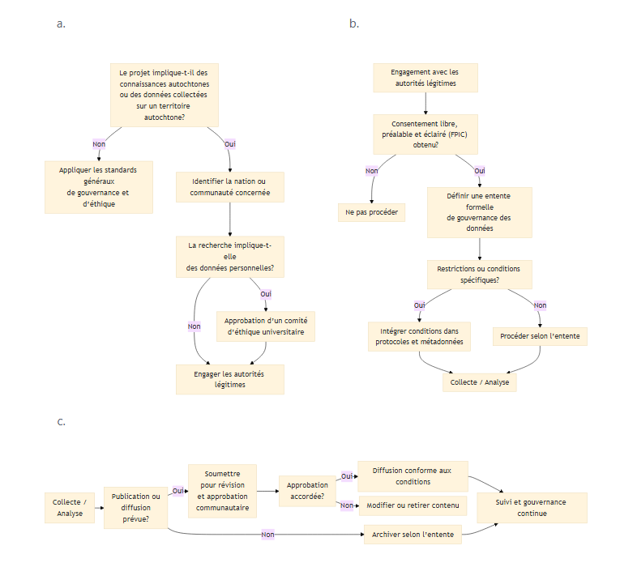

::: callout-caution
Le contenu de ce chapitre sujet à changer.
:::

::: callout-tip
Un résumé du contenu de ce document a été présenté lors d'un webinaire de dévoilement.
L'enregistrement est disponible [ici, sur la chaine YouTube du CSBQ](https://youtu.be/kyzUP54cMUk).
:::

# Document de cadrage {#sec-scoping}



## Contexte et objectifs

### Contexte et justification

Le déclin accéléré de la biodiversité représente un enjeu critique aux échelles provinciale, nationale et mondiale.
Le Québec s’est engagé à travers le Cadre mondial pour la biodiversité Kunming–Montréal et le Plan Nature 2030 à renforcer la conservation, la restauration et le suivi des écosystèmes.
La production d’un **rapport rigoureux, évolutif et en libre accès sur l’état de la biodiversité au Québec** constitue un levier essentiel pour:

- Soutenir la prise de décision basé sur des données probantes
- Mesurer les progrès de nos actions en matière de conservation de la biodiversité
- Informer les citoyen·ne·s, médias et organisations des changements en biodiversité
- Souligner l'importance de la contribution de la nature à la population du Québec
- Aider à freiner les menaces présentes et anticipées à la biodiversité
- Positionner le CSBQ comme pôle d’expertise et de référence

Ce document de cadrage définit les contour du projet et fournit une feuille de route pour ce projet.

### Définitions {#sec-def}

**Biodiversité**: la diversité de la vie sur la Terre.
Cette diversité à facette multiples peut être mesuré par des [variables essentielles de la biodiversité (EBV)](https://geobon.org/ebvs/what-are-ebvs/), incluant la diversité des :

- gènes (diversité et différenciations génétiques, taille effective de population, consanguinité),
- fonctionnements des écosystèmes (productivité primaire, phénologie et perturbations),
- structures des écosystèmes (fraction de couverture vivante, distribution, profil vertical),
- populations d'espèces (leurs distribution et leurs abondances),
- traits des espèces (morphologie, physiologie, phénologie, reproduction, mouvement),
- compositions des communautés (abondance, et diversité taxonomique, phylogénétique, des traits et des interactions).

**Contribution de la nature aux populations**: contributions, positives et négatives que la nature vivante (diversité des organismes, les écosystèmes, et les processus écologiques et évolutionnaires qui y sont associés) fournit à la qualité de vie humaine.
De plus, ce terme, dérivé de l'anglais Nature's Contributions to People (NCP), réfère à un cadre de travail utilisé par le International Panel on Biodiversity and Ecosystem Services et a pour but d'étudier les contributions à travers le prisme de différents contextes culturels [@díaz2018; @ipbes2019].

**Moteur de changement**: les facteurs causant, directement ou indirectement, des changements dans l'environnement naturel et anthropique, la contribution de la nature aux populations, et la qualité de vie.

**Levier de changement**: des actions stratégiques d'intervention qui ont un grand potentiel de générer des changements au niveau de la biodiversité et de la contribution de la nature aux populations.

### But et objectifs

Le but principal du projet est de produire une base factuelle **modulaire, évolutif et scientifiquement robuste** sur la biodiversité au Québec, intégrant données, indicateurs, littérature scientifique, avis d'experts, connaissances locales et autochtones, moteurs de changement, variables essentielles (EBV), contributions de la nature aux populations, état, tendances, projections, scénarios et recommandations adaptés aux décideurs du Québec.

#### Planification

Au sein du document présent, les objectifs sont les suivants:

- Mettre en place une **gouvernance claire et crédible**
- Établir un **cadre méthodologique** clair qui guidera les auteurs dans l'élaboration du rapport et permettra une communication efficace avec les publics cibles (par exemple, des critères pour les preuves scientifiques)
- Planifier la **validation scientifique indépendante**
- Prévoir un cadre qui permettra une **structure modulaire** permettant la publication progressive de chapitres et les auteurs et autrices de ceux-ci.

#### Rapport

Les objectifs du rapport seront:

- Établir un **portrait québécois** des moteurs de changement, de la biodiversité et des contributions de la nature aux populations
- Cibler les **lacunes majeures** parmi les données et études disponibles pour identifier les besoins en recherche
- Intégrer progressivement de nouvelles données et dimensions au rapport
- Établir des **scénarios** pour les projections
- Soutenir la **prise de décision** des différents acteurs de la gestion de la nature de notre société (conformément à la vision du IPBES [@IPBESassesment])

#### Sommaires exécutifs

Les conclusions de l’évaluation seront complémentées par des sommaires exécutifs servant à :

- **synthétiser l’état des connaissances** afin d’éclairer les décisions stratégiques en matière de réseaux de suivi et de conservation ;
- **identifier les principaux moteurs de changement** sur la biodiversité, afin de cibler les interventions publiques ;
- **proposer des leviers de changements synergiques** qui permettrait de maximiser simultanément les effets positifs sur plusieurs aspects de la biodiversité et de la contribution de la nature aux populations;
- **appuyer la prise de décision**, notamment dans les domaines de la conservation, de la foresterie, de l’agriculture, de l’aménagement et de la planification territoriale ;
- **fournir une base scientifique commune** facilitant la coordination entre ministères, agences gouvernementales et autres acteurs.

#### Contribution au cadre de suivi du Plan Nature

L’évaluation contribuera également à soutenir le cadre de suivi du Plan Nature 2030 en :

- consolidant et synthétisant les informations nécessaires au **suivi des indicateurs de biodiversité** (objectif 9.2 du Plan d'action 2024-2028; @MELCCFP2024PlanNatureAction).
- identifiant les **lacunes dans les données et les réseaux de suivi** (cible 9 du Plan Nature 2030; @MELCCFP2024PlanNature2030);
- proposant des **indicateurs et approches d’évaluation complémentaires** lorsque pertinent (en accord avec la «Note 2» du Plan d'action 2024-2028; @MELCCFP2024PlanNatureAction);
- fournissant une analyse intégrée permettant d’interpréter les indicateurs dans un contexte écologique et socio-écologique plus large.

Ainsi, le rapport et les sommaires exécutifs visent non seulement à faire un état de la connaissance scientifique, mais aussi à **renforcer l’interface science-politique** et à soutenir une prise de décision fondée sur les données probantes pour la conservation et l’utilisation durable de la biodiversité au Québec.

#### Retombées pour la recherche au CSBQ et au delà

Ce projet vise aussi à générer des retombées pour le CSBQ et la recherche dans le domaine de la biodiversité:

- Contribuer à **la mission** du CSBQ dans son entièreté: « Accroître et renforcer la capacité scientifique du Québec à comprendre, protéger et valoriser la biodiversité, ainsi que soutenir le développement de politiques publiques fondées sur la connaissance, grâce à de la recherche et de la formation scientifique de niveau international, et à une communauté de pratique dynamique. » 
- **Mobiliser la communauté** du CSBQ autour d'un projet intégrateur via la collaboration au sein des groupes de travail.
- **Créer de nouveaux liens** entre les membres du CSBQ et d'autres acteurs œuvrant dans le domaine de la biodiversité au Québec.
- **Identifier les besoins** de recherche pour aider à orienter les efforts des chercheurs et chercheuses du CSBQ (et d'ailleurs).
- Contribuer à la **formation des étudiants** du CSBQ.
- **Favoriser le rayonnement** du CSBQ et de la biodiversité.

## Cadre méthodologique

Le rapport se basera sur des données ouvertes, des données fermées (ex: disponibles seulement au sein du gouvernement), la littérature scientifique, des avis d'experts et des connaissances locales et autochtones.

### Portée Géographique

La portée du projet se limitera au territoire québécois, incluant les milieux terrestres, marins et les eaux douces.
À noter que c'est possible que la méthodologie de certains modules implique l'utilisation de données d'au-delà des limites du Québec, par exemple pour modéliser les distributions des espèces qui se déplacent depuis les États-Unis en réponse aux changements climatiques.
En termes d'échelle spatiale, l'objectif est d'avoir la meilleure résolution possible en tenant compte des limites techniques et des données disponibles.

### Cycle de travail

Cette évaluation vise à renforcer la gouvernance de la biodiversité au Québec en soutenant un cycle continu de production et d’utilisation des connaissances pour l’action publique.
Elle s’inscrit dans une logique de gestion adaptative, structurée autour d’un cycle d’information et de décision inspiré des [axes de recherche du Centre de la science de la biodiversité du Québec (CSBQ)](https://qcbs.ca/overview/):

{#fig-work-cycle fig-alt="Suivi et observation → Indicateurs → Statut et tendances → Attribution des causes → Scénarios prospectifs → Orientations pour les politiques publiques → Gestion adaptative → Retour au suivi et à l’observation" width="2.94in"}

Dans ce cycle de travail [@fig-work-cycle]:

- **Le suivi et l’observation** fournissent les données empiriques issues des réseaux de surveillance, des programmes de recherche et des initiatives de science participative.
- **Les indicateurs** traduisent ces données en mesures synthétiques permettant d’évaluer l’état de la biodiversité et ses évolutions.
- **L’analyse du statut et des tendances** permet de documenter les changements observés dans les différents aspects de la biodiversité [@sec-def].
- **L’attribution** vise à identifier les moteurs responsables de ces changements.
- **Les scénarios prospectifs** explorent les trajectoires possibles de la biodiversité selon différents choix de gestion et de politiques publiques.
- **Les orientations pour les politiques publiques** traduisent ces analyses en informations utiles à la décision.
- **La gestion adaptative** permet ensuite d’ajuster les interventions et les politiques, en s’appuyant sur de nouvelles observations et données de suivi.

### Principes généraux

L’évaluation repose sur quatre principes directeurs :

1.  Rigueur scientifique et transparence
    - Toutes les analyses doivent être reproductibles, documentées et appuyées par des données traçables.
2.  Approche multi-niveaux de la biodiversité
    - L’évaluation couvre les niveaux génétique, des populations, des espèces, des communautés, de la structure et du fonctionnement des écosystèmes, ainsi que les contributions de la nature aux populations (NCP).
3.  Intégration des moteurs de changement
    - L’évaluation ne se limite pas à décrire l’état; elle analyse également les tendances, les causes probables et les scénarios futurs.
4.  Modularité cohérente
    - Chaque chapitre suit une structure commune afin d’assurer la comparabilité et intégration transversale.

### Cadre analytique général

L’évaluation s’organise autour de cinq composantes analytiques :

1.  État actuel
2.  Tendances temporelles
3.  Moteurs et attribution
4.  Projections et scénarios
5.  Incertitudes et lacunes

Chaque groupe de travail doit explicitement traiter ces cinq composantes.

### Définition et évaluation de l’état actuel

#### Définition

**L’état** correspond à la condition actuelle d’un moteur de changement, d'une composante de la biodiversité ou d’une NCP, mesurée par un ou plusieurs indicateurs quantitatifs.

#### Types de référence

Lorsque possible, l’état sera évalué par rapport à :

- Une référence historique (ex. 1970, 1990, ou période préindustrielle lorsque pertinente)
- Une cible politique (Plan Nature 2030, objectifs du Cadre mondial pour la biodiversité)
- Un seuil écologique ou biologique documenté
- Une condition de référence spatiale (comparaison entre régions)

La référence choisie devra être explicitement justifiée.

#### Résolution spatiale

Les indicateurs doivent être produits à la plus fine résolution compatible avec les données disponibles, tout en permettant une agrégation aux échelles suivantes :

- Écozones
- Bassins versants
- Régions administratives
- Province entière

Les limites spatiales utilisées doivent être harmonisées entre chapitres lorsque possible.

### Analyse des tendances temporelles

#### Exigences minimales

Une analyse de tendance requiert :

- Une série temporelle explicite
- Une description de l’effort d’échantillonnage
- Une méthode statistique adaptée à la structure des données

#### Méthodes analytiques possibles

Selon le type de données :

- Modèles linéaires ou généralisés
- Modèles mixtes hiérarchiques
- Modèles d’occupation
- Capture-marquage-recapture
- Modèles d’état-espace
- Séries temporelles bayésiennes
- Indices composites

Les choix méthodologiques doivent être justifiés et documentés.

#### Détection et puissance statistique

Lorsque pertinent, les groupes de travail doivent :

- Estimer la capacité de détecter un changement (puissance statistique)
- Identifier les limites liées à la durée ou à la qualité des séries temporelles

### Analyse des moteurs de changement et attribution

L’attribution vise à déterminer si les changements observés peuvent être reliés à des moteurs identifiables.

#### Catégories de moteurs de changement

La catégorisation des moteurs de changement suit la typologie des menaces du MELCCFP [@mffp2021classification].

- Développement résidentiel et commercial
- Agriculture et aquaculture
- Production d'énergie et mines
- Corridors de transport et services
- Exploitation de ressources biologiques
- Intrusions et perturbations humaines
- Modifications des systèmes naturels
- Espèces, gènes et pathogènes envahissants ou problématiques
- Pollution
- Évènements géologiques
- Changements climatiques et temps violent

#### Approches d’attribution

- Modèles statistiques multivariés
- Comparaisons spatiales (zones contrastées)
- Analyses de corrélation avec variables environnementales
- Expériences naturelles
- Approches mécanistiques lorsque disponibles

Les conclusions d’attribution doivent préciser :

- Le niveau de confiance
- Les limites analytiques
- Les hypothèses sous-jacentes

### Contributions de la nature aux populations (NCP)

L’évaluation inclut les contributions matérielles, régulatrices et non matérielles de la nature.

Pour chaque NCP analysée :

- Décrire le lien avec la biodiversité
- Identifier les indicateurs biophysiques
- Intégrer, lorsque possible, des données sociales ou économiques
- Identifier les inégalités spatiales ou sociales

### Projections et scénarios futurs

#### Objectif

Explorer les trajectoires plausibles futures sous différents scénarios environnementaux ou politiques.

#### Types de scénarios

- Scénarios climatiques (ex. SSP/RCP)
- Scénarios d’aménagement du territoire
- Scénarios combinés
- Scénarios d’atteinte ou non des cibles du Plan Nature

#### Distinction importante

Les chapitres doivent clairement distinguer :

- Projections exploratoires
- Simulations liées à des cibles politiques
- Scénarios normatifs

### Intégration des connaissances autochtones et locales

L’intégration des savoirs autochtones et locaux doit :

- Respecter les principes de gouvernance des données (CARE et FAIR; Consultez @sec-protocole-connaissances-locales)
- Être basée sur un consentement préalable et informé
- Reconnaître la propriété intellectuelle
- Documenter les modalités d’intégration.

Ces savoirs peuvent contribuer à:

- L’identification des tendances,
- La contextualisation historique,
- L’interprétation des changements.

### Classification du niveau de confiance

Chaque conclusion doit être accompagnée d’une évaluation qualitative soutenue par l'expertise et vérifiée lors du processus de révision [@sec-revision] :

1.  Force des données (faible / modérée / élevée)
2.  Concordance entre sources (faible / modérée / élevée)
3.  Couverture spatiale et temporelle

Cette approche a pour but de rendre l'information plus crédible et digeste pour les décideurs.

### Gestion des incertitudes

Les incertitudes doivent être explicitement documentées :

- Incertitudes liées aux données
- Incertitudes méthodologiques
- Incertitudes liées aux scénarios
- Zones géographiques sous-échantillonnées

Lorsque possible, des intervalles de confiance ou distributions de probabilité doivent être fournis.

### Données et reproductibilité

#### Sources de données

Les données peuvent inclure :

- Données ouvertes (ex. GBIF, télédétection)
- Données gouvernementales
- Données issues de programmes de suivi
- Littérature scientifique
- Connaissances locales et autochtones

Chaque chapitre doit inclure :

- Une description des sources
- Les métadonnées pertinentes
- Les limites d’utilisation

#### Reproductibilité

Les analyses doivent être :

- Documentées par scripts reproductibles
- Versionnées (ex. Git)
- Archivées dans un dépôt institutionnel lorsque possible

Voir @sec-flux-repr pour plus de détails sur le flux de travail.

### Formats de publication

- **Site web dynamique** (avec textes, graphiques et des tableau de bord évolutives)
- Divisé en chapitres
- Facile à mettre à jour
- Liens internes et références
- Visualisations statiques et interactives
- Format bilingue (anglais et français)
- Possibilité de commentaires interactifs
- **PDF exportable** par chapitre
- Même contenu que le site web, mais sans éléments intéractifs
- **Sommaires exécutifs** web et pdf, courts et accessibles par chapitre
- Infographies résumées
- Des courtes vidéos

### Technologies utilisés {#sec-tech}

Pour assurer une accessibilité aux chercheurs, mais une intégration facile avec plusieurs formats de sortie (html, pdf) le site web sera écrit avec en utilisant [Quarto](https://quarto.org/).
Les chercheurs écriront leur prose en format [Markdown](https://www.markdownguide.org/) qui est léger et facile à comprendre et inclut des images, du code (exécuté ou non), des références (internes et externes).
Les logiciels tels que Rstudio de Posit incluent un mode de modification visuel pour rendre Quarto plus facile à adopter pour les débutants.

- Le formatage en texte brut utilisé par Quarto permettra un suivi de l'historique des versions et une collaboration efficace avec [git](https://git-scm.com/) et [GitHub](https://github.com/).
- Les tableaux de bords interactifs pourront être créés avec [R Shiny](https://shiny.posit.co/) et pourront être implémentés [directement au sein des fichiers Quarto](https://quarto.org/docs/interactive/shiny/).
- L'inclusion du code directement, ou des références vers des fichiers mis à jour, au sein de fichiers Quarto assurera une reproductibilité des calculs et des analyses et permettra de faciliter les mises à jour.
- Des formations seront offertes par l'équipe de support pour encadrer les personnes étudiantes, les chercheurs et les chercheuses du CSBQ dans l'utilisation de ces outils.
- Les fichiers quarto pourront être rendus directement en site web avec un format livre, et un [thème Quarto adapté au rapport](https://quarto.org/docs/output-formats/html-themes.html), ou rendu en format Markdown pour être intégré dans [un site web Hugo](https://gohugo.io/).
- L'intégration d'outils comme [Hypothes.is](Hypothes.is) permettra aux membres des comités et au public de fournir des annotations au site web, le rendant réellement vivant. À noter qu'un effort de modération sera nécessaire si la possibilité de laisser des commentaires sera ouverte au public.
- La traduction anglais-français pourra être assistée par la version payante de l'outil d'intelligence artificielle [DeepL](https://www.deepl.com/en/translator) (la version gratuite n'est pas approuvée pour [l'utilisation McGill](https://www.mcgill.ca/linguistic-services/language-resources/ai-translation-guide)) et [le progiciel babeldown](https://docs.ropensci.org/babeldown/). Par contre, la traduction doit être approuvée par l'intelligence humaines.
- Si Quarto est utilisé directement pour générer le site web, [babelquarto](https://docs.ropensci.org/babelquarto/) pourra être utilisé pour générer un site web bilingue. Si Hugo est utilisé, [le mode multilingue](https://gohugo.io/content-management/multilingual/) devra être utilisé.
- Le site web généré sera entièrement en HTML, CSS et JavaScript et pourra donc être hébergé sur la majorité des serveurs disponibles sur le web.

#### Flux de travail collaboratif et reproductible {#sec-flux-repr}

Plusieurs groupes de travail auront à collaborer sur un seul chapitre [@sec-wg].
L'utilisation de la fonctionnalité de branches du logiciel `git` permettra aux différents groupes de travail de travailler indépendamment sur leurs tâches respectives [@sec-tech].
Ensuite, une personne responsable de l'équipe de support sera chargée de fusionner les branches des différents groupes de travail au tronc commun à mesure que les tâches sont accomplies.

Pour éviter l'alourdissement excessif d'un chapitre Quarto, toute modélisation et graphisme devront être faites à l'extérieur du fichier Quarto, en utilisant un script dédié.
Ensuite, les sorties pourront être directement référencées à l'intérieur du document Quarto.
Ceci garantira que chaque groupe de travail n'aura qu'à utiliser que les outils technologiques nécessaires à leur travail et n'aura pas besoin d'exécuter les analyses de ses collègues des autres groupes de travail.

Un calque pour l'organisation des dossiers:

```{r}
library(fs)
dir_create("temp-dirs")
setwd("temp-dirs")
dir <- path("Rapport-Biodiv-QC")
dir_create(dir, "Chap1")
file_create(dir, "Chap1/01-Contexte.qmd")
dir_create(dir, "Chap3/wg-genes")
dir_create(dir, "Chap3/wg-especes")
dir_create(dir, "Chap3/wg-especes/data/raw/")
dir_create(dir, "Chap3/wg-especes/data/tidy/")
dir_create(dir, "Chap3/wg-especes/analysis/")
dir_create(dir, "Chap3/wg-especes/out/")
dir_create(dir, "Chap3/wg-especes/fig/")
dir_create(dir, "Chap3/wg-traits")
file_create(dir, "Chap3/03-Nature.qmd")
file_create(dir, "Chap3/03-tableau-de-bord_.qmd")
dir_tree(dir)
dir_delete(dir)
setwd("..")

```

Chaque chapitre réside dans son dossier respectif.
Sous chaque chapitre, il y aura un fichier Quarto (`.qmd`).
Chaque groupe de travail travaillant sur un chapitre aura son dossier figurant des sous-dossiers contenant des données brutes (`data/raw`) et nettoyées (`data/tidy`), leurs analyses (`data/analysis`), les résultats textuels (`data/raw`) et graphiques (`data/fig`).
Les tableaux de bord seront créés à partir de fichiers Quarto indépendants du texte principal mais seront référencés dans le document principal.
Les autres éléments interactifs seront intégrés directement au document de texte principal.
Pour chaque élément interactif, une version statique devra être créée pour le format pdf (voir [cette discussion](https://github.com/orgs/quarto-dev/discussions/6665)).

### Structure proposé pour les chapitres

Chaque module ou chapitre doit suivre la structure suivante :

0.  Sommaire exécutif
    - Messages clés
    - Lacunes et priorités futures
    - Recommandations générales
1.  Introduction et justification
2.  Cadre conceptuel
3.  Données utilisées
4.  Méthodes analytiques
5.  Résultats – État
6.  Résultats – Tendances
7.  Moteurs et attribution
8.  Incertitudes
9.  Implications pour le Plan Nature et autres cadres
10. Lacunes et priorités de recherche
11. Bibliographie

### Synthèse transversale

Une équipe de synthèse assurera :

- L’intégration entre dimensions génétiques, spécifiques et écosystémiques
- La cohérence entre biodiversité et NCP
- L’identification de contradictions ou convergences
- La production de graphiques synthétiques commun

### Conclusion méthodologique

Ce cadre vise à assurer que l’évaluation québécoise de la biodiversité soit :

- Scientifiquement robuste
- Transparente
- Comparable dans le temps
- Alignée avec les cadres internationaux
- Pertinente pour la prise de décision

Il constitue la référence obligatoire pour tous les groupes de travail.

## Structure de gouvernance

### Comité exécutif (orientation stratégique)

**Rôle:** définir les priorités, arbitrer les décisions structurantes, superviser le projet en assurer la crédibilité du projet

**Composition (indicative):** 4–5 scientifiques seniors

- Fanie Pelletier (CSBQ, UdeS),
- Andrew Gonzalez (CSBQ, McGill),
- Dominique Gravel (CSBQ, Biodiversité Québec, UdeS),
- Guillaume Blanchet (CSBQ, UdeS),
- Sara Teitelbaum (CSBQ, UdeM)
- **TODO** Indigenous and Local Knowledge : Brenda Parlee (non-QCBS)

### Équipe de support et de coordination

**Coordonnateur principal** (CSBQ) — pilotage opérationnel, échéancier, livrables, suivi des réunions.
Pour les livrables: créer des synthèses de textes, assurer une cohérence des textes et du graphisme.
Intégrer les différents chapitres, identifier les lacunes, et aider à la recherche des personnes pouvant pallier les lacunes.
Faciliter la communication entre les différents comités et groupes de travail.

- Egor Katkov (professionnel de recherche au CSBQ).

**Conseil de coordination** (CSBQ) — conseils scientifique pour le comité exécutif et support technique pour les groupes de travail et le coordonnateur principal.

- Guillaume Larocque (professionnel de recherche au CSBQ),
- El-Amine Mimouni (professionnel de recherche au CSBQ).

### Comité de communication

**Rôles:** - Définir les lignes de communication, parler aux journalistes, et assurer le rayonnement du CSBQ au travers du rapport.
- Proposer une esthétique unifiée

- Samuel Enright
- Fanie Pelletier
- Egor Katkov

### Comité de codirection scientifique

Ce comité sera ouvert à tous les membres chercheurs du CSBQ.

**Recrutement**: Une invitation généralisée sera envoyée par courriel.
De plus, des invitations ciblées seront envoyées pour recruter des personnes expertes sélectionnées par le comité exécutif.

Rôle: Assurer la direction scientifique, conceptuelle, méthodologique et éditoriale du projet.

### Comité consultatif et aviseur (validation indépendante)

**Rôle:** évaluer la qualité scientifique, la neutralité, la pertinence sociale et politique

**Positions au sein du comité**

- Représentants de différentes communautés autochtones (2-3)
  - Représentation du nord du Québec.
- Représentants gouvernementaux (2-3):
  - MELCCFP
  - Ministère des ressources naturelles
- Représentants du milieu des ONG (2-3)
- Représentants du milieu para-académique (musées, collections; 2-3)
- Représentants des rapports provinciaux sur la biodiversité:
  - ABMI (Alberta biodiversity monitoring institute)
  - Ontario Biodiversity Council)
- Représentants des différents regroupements stratégiques québécois travaillant en lien avec la biodiversité:
  - CEF (milieu forestier),
  - CEN (milieu nordique),
  - SÈVE (milieu agricole),
  - Québec-Océan,
  - GRIL (eaux douces).

### Groupes de travail thématiques {#sec-wg}

Chaque groupe de travail se concentre sur le développement d'un chapitre.

**Recrutement**: Un courriel sera envoyé aux membres du CSBQ pour recruter des chercheurs et des étudiants pour travailler sur les différents chapitres du rapport.
Des courriels ciblés pourraient aussi être envoyés à des experts dans certains domaines.

**Rôle:** produire les modules et chapitres

**Composition:** chercheur·e·s, étudiant·e·s, experts sectoriels, membres de l'équipe de support et coordination.

**Exemples de groupes pour un chapitre (basé sur la classification des EBV** [@kissling2018]**):**

- composition génétique
- populations d'espèces
- traits des espèces
- composition des communautés
- structure des écosystèmes
- fonctionnement des écosystèmes

La majorité des chapitres vont nécessiter une multitude d'expertises de différents groupes de travail thématiques.

**Fonctionnement** [@fig-wg]: Le groupe de travail discutera ce qui devrait être inclus dans un chapitre relativement à leur thème et se divisera les tâches entre ses membres et collaboreront à l'aide du programme `git` [Voir @sec-tech pour plus de détails sur les aspect technologiques de la collaboration].
Les membres du comité de support et coordination feront partie des discussions pour éviter que le travail ne dépasse la portée du chapitre ou du rapport, pour aider à identifier des lacunes, et au besoin, trouver des personnes qui pourraient aider à combler ces lacunes.
L'équipe de support fournira aussi la formation nécessaire pour l'utilisation d'un système d'écriture qui pourra assurer une collaboration efficace (GitHub) et un format d'écriture compatible avec un site web dynamique, ou un document statique (Quarto).

```{mermaid}
%%| label: fig-wg
%%| fig-cap: Mode de fonctionnement pour un groupe de travail thématique
%%| fig-height: 5
---
config:
  theme: base
---

flowchart TD
  A[Discuter du plan et assigner les tâches] --> B{"La portée du projet et du chapitre<br> est respecté?"}
  B -->|Non| A
  B -->|Oui| C{'Lacunes<br>identifiées?'}
  C -->|Non| D[Rédiger une ébauche]
  C -->|Oui| E[Inviter des collaborateurs supplémentaires]
  E --> A
  E --> D
  D --> F["Révision (voir section sur la révision)"]
```

Lorsque le comité de révision juge que le chapitre est suffisamment informatif et scientifiquement robuste pour la publication, les membres du groupe de travail pourront élire de continuer le travail pour développer:

1.  un prochain chapitre, ou
2.  une mise à jour pour un chapitre.

### Hiérarchie décisionnelle

Les **désaccords scientifiques** au sein des groupes de travail pourront être amenés au comité scientifique.
Le comité scientifique pourra, à sa discrétion, consulter des membres externes ou du comité aviseur pour aider à résoudre le désaccord.
Un suivi du désaccord devra être fait par l'équipe de support et sera résumé dans un annexe du rapport ou une note en bas de page.

La **publication** d'un chapitre ou d'un module devra être révisée en détail par au moins deux membres du comité aviseur, et deux membres du comité scientifique, et finalement approuvée par le comité exécutif.
En plus des membres du groupe de travail, les membres du comité scientifique seront chargés de s'assurer que les niveaux d'incertitude sont admissibles et clairement communiqués avant la publication.

### Politique de conflit d’intérêt {#sec-conflit-interet}

Un conflit d’intérêt est une situation où la neutralité ou l'objectivité d'une personne ou d'une institution ayant influencé une prise de décision pourrait être remise en cause.
Par exemple, la contribution d'un employé du gouvernement à la section du rapport concernant la mise en œuvre pourrait être considéré comme un conflit d'intérêt.

Les conflits d'intérêt sont un frein à la crédibilité du rapport.
Par contre, le nombre d'experts est limité au Québec, et c'est inévitable que certaines personnes aient à porter plusieurs chapeaux.
Il faut donc balancer l'accès à l'expertise avec la perte de crédibilité associée aux conflits d'intérêt.

Nous exigeons que toutes les personnes remplissent un formulaire de déclaration des conflits d'intérêt avant de contribuer au rapport.
Les déclarations pourront être révisés tout au long du processus d'écriture et seront soumis au processus de révision [@sec-revision].
Un déclaration excluant des informations confidentielles comme des montants financiers sera publiée en même temps que le rapport.

Pour ne pas exclure des personnes ayant des expertise précieuses, des mesures de mitigation des conflits d'intérêt seront proposées par l'équipe de support.
Par exemple, l'employé du gouvernement peut contribuer à la recherche de données, mais pas à l'analyse, aux conclusions ou aux recommandations.
Ensuite, la proposition pourra être modifiée et devra être approuvée par le comité exécutif.
Si le conflit d'intérêt concerne un membre du comité exécutif, un sous-comité de conflit d'intérêt au sein du comité aviseur sera créé pour évaluer le cas.

### Protocole de gouvernance des connaissances autochtones et locales {#sec-protocole-connaissances-locales}

Le CSBQ reconnaît que les Nations et communautés autochtones sont **détentrices de droits** en matière de connaissances autochtones et de données collectées sur leurs territoires.
Le présent protocole repose sur la souveraineté des données autochtones et intègre les principes FPIC (consentement libre, préalable et éclairé), CARE (avantage collectif, pouvoir de contrôle, responsabilité et éthique; @jennings2023) et, lorsque pertinent et approprié, FAIR (facile à trouver, accessible, interopérable et réutilisable; @wilkinson2016).

#### Consentement et autorité

Toute mobilisation de connaissances autochtones est assujettie au consentement préalable, libre et éclairé (FPIC) obtenu selon les structures décisionnelles légitimes de la Nation concernée.

Le consentement :

- Doit être obtenu avant toute collecte, analyse ou diffusion.
- Est un processus continu et révisable.
- Peut inclure des restrictions partielles ou complètes.
- Peut être retiré selon les modalités convenues.

Les communautés conservent un contrôle continu sur l’utilisation, la diffusion, l’archivage et la réutilisation des données, y compris dans des environnements numériques.

#### Gouvernance et souveraineté des données

Le CSBQ reconnaît la souveraineté des données autochtones, incluant l’autorité des nations à :

- Déterminer les conditions d’accès et d’usage.
- Encadrer la diffusion publique ou restreinte.
- Autoriser ou refuser la réutilisation secondaire.
- Définir les modalités d’archivage ou de retrait.

Lorsque des standards de gestion des données sont appliqués (par exemple, les principes FAIR), ceux-ci ne peuvent en aucun cas prévaloir sur les droits et protocoles définis par les communautés conformément aux principes CARE.

#### Attribution, provenance et propriété intellectuelle

La provenance des connaissances doit être rigoureusement documentée.

Les métadonnées doivent :

- Identifier clairement les détenteurs de droits.
- Indiquer les conditions d’utilisation.
- Refléter les protocoles communautaires applicables.

Toute publication ou diffusion :

- Est soumise à un droit de révision et d’approbation par les communautés concernées.
- Doit respecter les modalités d’attribution convenues.
- Doit reconnaître explicitement les contributions autochtones, y compris lorsque pertinent en matière d’autorat ou de propriété intellectuelle.

#### Retombées collectives et réciprocité

Les objectifs et bénéfices doivent être co-définis avec les communautés.

Le processus doit :

- Maximiser les retombées collectives.
- Soutenir le renforcement des capacités locales.
- Valoriser et, le cas échéant, compenser les expertises autochtones.
- Éviter toute dynamique extractive.

Les livrables doivent être accessibles dans des formats, langues et modalités adaptés.

#### Éthique et mécanismes de révision

Le CSBQ s’engage à :

- Respecter les cadres éthiques propres aux nations concernées.
- Reconnaître les asymétries de pouvoir et les contextes historiques.
- Évaluer et minimiser les impacts négatifs potentiels.

Lorsque requis, les activités impliquant des connaissances autochtones doivent être soumises (@fig-ethic) :

- Aux mécanismes de révision ou d’approbation communautaires applicables.
- À un comité d'éthique de la recherche d'une institution universitaire québécoise (ex: « research ethics board » de l'Université McGill).

La conformité aux ententes établies fait l’objet d’un suivi documenté.

{#fig-ethic}

### Processus de révision {#sec-revision}

Avec l'avis de l'équipe de support, le comité exécutif sera chargé d'initier le processus de révision pour un chapitre.

**Étape 1: Révision interne**

Le chapitre est révisé en détail par au moins deux membres du comité scientifique.
Les commentaires sont envoyés à l'équipe de support qui les adresse directement ou les apporte au groupe de travail concerné.
Ce processus se répète jusqu'à la satisfaction des membres du comité scientifique.

**Étape 2: Révision scientifique externe**

Au moins 60% des membres du comité consultatif doivent consulter le document produit et envoyer une brève évaluation et, au besoin, des commentaires à l'équipe de support.
L'équipe de support adresse les commentaires ou les apporte au groupe de travail concerné.

Le comité aviseur peut demander d'engager d'autres experts indépendants dans le processus de révision.

Tous les changements doivent être soumis à la révision interne (Étape 1), mais n'ont pas besoin d'être réévalués par le comité consultatif.

**Étape 3: Révision gouvernementale (limitée)**

Des représentants du MELCCFP réviseront uniquement les sommaires exécutifs et n'auront pas de droits de modification scientifique.
Leurs commentaires seront adressés par l'équipe de support ou par le groupe de travail concerné.
Les changements seront ensuite soumis à la révision interne (Étape 1).

#### Transparence

Les commentaires transmis lors de tous les processus de révision seront enregistrés comme des tâches GitHub et associés aux changements correspondants dans l'historique des versions.

#### Révision des mises à jour

Le processus de révision doit être proportionnel à l'impact du changement sur le message.

```{mermaid}
%%| label: fig-update
%%| fig-cap: Procédure pour faire des mises à jour au rapport
%%| fig-height: 5
---
config:
  theme: base
---

flowchart TD
  A{"Quel est le type de mise à jour?"}
  A --> |"Ajout d'un nouveau module ou d'une section à un module"| C["Révision interne et externe"]
  A --> |"Mise à jour de la méthodologie ou des données"| G{Les conclusions sont-elles affectés?}
  G --> |Oui| C
  G --> |Non| H["Révision interne"]
  A --> |"Correction mineure (clarifications, définition, formulation, ou orthographe)"| H
```

### Réutilisation et attribution

Lorsque possible, le texte et les données générés dans seront sous licence [CC-BY](https://creativecommons.org/licenses/by/4.0/deed.fr).
Cette licence permet le partage et l'adaptation du matériel à condition de créditer les auteurs de l’œuvre originale.

Lorsque possible, le code source utilisé pour les analyses et la mise en page sera sous licence [MIT](https://opensource.org/license/MIT).

## Approche de communication

### Publics cibles

- Chercheur·e·s
- Décideurs publics
- ONG et praticiens
- Journalistes
- Grand public

### Stratégies

- Lancements par chapitre
- Résumés vulgarisés
- Partenariat avec experts en communication
- Révision des messages par des experts interdisciplinaires ou en partenariat avec des utilisateurs cibles (décideurs, ONG, journalistes, étudiantes) pour évaluer la pertinence sociale et politique

### Produits dérivés

- Infographies
- Capsules web
- Présentations publiques

## Échéancier indicatif (@fig-echeancier) {#sec-échéancier}

### Phase 1 — Cadrage (janvier–avril 2026)

- Webinaire pour présenter une ébauche du document de cadrage au CSBQ
- Mise en place des comités
- Validation de la table des matières

**Livrables**:

- Finalisation du document de cadrage
- Plan de communication de lancement
- Communiqué de presse 

### Phase 2 — Déploiement initial (été et automne 2026)

- Lancement des premiers groupes de travail
- Plan de communication pour le déploiement initial
- Publication des premiers modules pilotes.

**Livrables**:

- Prototype pour l'architecture web
- Module pilote 1 (par exemple, l'empreinte humaine)
- Module pilote 2 (par exemple, diversité génétique)
- Guide d'identité visuelle
- Protocole de gestion de données
- (Communiqué de presse)

### Phase 3 — Consolidation (2027)

- Intégration de nouveaux chapitres.
- Publication de la **version 1 consolidée**

**Livrables:**

- Synthèse des état et tendances (\@sec-partie2), incluant:
  - État des composantes de la nature
    - Premiers tableaux de bord interactifs
  - Moteurs de changement et attribution des changements
  - Contribution de la nature aux populations
- Rapport synthèse des incertitudes
- Communiqué de presse 

### Phase 4 — Mise à jour continue (hiver 2028)

**Livrables**:

- Version 1 du rapport consolidé
- Sommaire exécutif
- Annexe technique
- Dépôt des données publics
- Dépôt du code reproductible
- Communiqué de presse 

**Échéance critique:** Évaluation FRQ en mars 2028.

```{mermaid}
%%| fig-cap: Échéancier pour l’évaluation québécoise de la biodiversité
%%| label: fig-echeancier
%%| column: page

---
config:
  theme: base
  gantt:
    fontSize: 14
    sectionFontSize: 14
  themeCSS: |
    .today {
      stroke: #ff4500 !important;
      stroke-width: 1px !important;
      stroke-dasharray: 8,4 !important;
    }
    .tick text {
      font-size: 14px; /* Adjust the size as needed */
    }

---

gantt
    title Échéancier indicatif
    dateFormat  YYYY-MM-DD
    axisFormat  %b %Y

    %% =========================
    section Phase 1 — <br /> Cadrage <br /> (jan–mars 2026)
    Mise en place des comités                 :p1a, 2026-01-01, 2026-03-31
    Validation table des matières             :p1b, after p1a, 20d
    Webinaire CSBQ (ébauche cadrage)          :p1w, 2026-03-25, 5d

    Finalisation document de cadrage          :p1c, 2026-02-01, 2026-04-20
    Plan de communication pour lancement      :p1d, 2026-02-15, 2026-04-15
    Communiqué de presse                      :milestone, 2026-04-30, 1d

    %% =========================
    section Phase 2 — <br /> Déploiement initial <br /> (été–automne 2026)
    Lancement groupes de travail              :p2a, 2026-02-01, 2026-07-15
    Plan communication                        :p2b, 2026-06-01, 2026-09-01

    Protocole gestion données                 :p2e, 2026-04-01, 2026-06-15
    Prototype architecture web                :p2c, 2026-05-01, 2026-09-01
    Guide identité visuelle                   :p2d, 2026-05-01, 2026-09-01

    Module pilote 1 — Empreinte humaine       :p2f, 2026-09-01, 2026-11-15
    Module pilote 2 — Diversité génétique     :p2g, 2026-02-12, 2026-11-30
    Publication modules pilotes               :milestone, 2026-11-30, 1d
    Communiqué de presse                      :milestone, 2026-12-05, 1d

    %% =========================
    section Phase 3 — Consolidation (2027)
    Intégration nouveaux chapitres            :p3a, 2027-01-01, 2027-12-01

    Synthèse état et tendances                :p3b, 2027-01-01, 2027-09-01
    Contribution nature aux populations          :p3c, 2027-02-01, 2027-10-01
    Moteurs de changement et attribution         :p3d, 2027-03-01, 2027-11-01
    Tableaux de bord interactifs              :p3e, 2027-06-01, 2027-12-15
    Rapport synthèse incertitudes             :p3f, 2027-09-01, 2027-12-15

    Version 1 consolidée                      :milestone, 2027-12-20, 1d
    Communiqué de presse                      :milestone, 2028-01-10, 1d

    %% =========================
    section Phase 4 — Mise à jour continue (hiver 2028)
    Version 1 rapport consolidé (format final):p4a, 2028-01-05, 2028-02-15
    Sommaire exécutif                         :p4b, 2028-01-10, 2028-02-15
    Annexe technique                          :p4c, 2028-01-10, 2028-02-28
    Dépôt données publiques                   :p4d, 2028-02-01, 2028-03-15
    Dépôt code reproductible                  :p4e, 2028-02-01, 2028-03-15
    Communiqué de presse                      :milestone, 2028-02-20, 1d

    Évaluation FRQ                            :crit, milestone, 2028-03-31, 1d
```

## Facteurs de succès et de risque

### Facteurs de succès

- Leadership clair
- Capacité réelle de livraison
- Engagement des membres du CSBQ
- Coaliser les chercheurs à travers le Québec
- Implication des acteurs du milieu de la biodiversité
- Modularité (éviter un rapport monolithique)
- Rigueur scientifique + pertinence sociale

### Facteurs de risque

- Lacunes de données dans le systèmes marins et d'eau douce
- Bias spatial vers le sud du Québec
- Couverture temporelle inégale
- Sensibilité politique des résultats
- Fatigue communicationnelle de la population québécoise

## Prochaines étapes immédiates

1.  Valider ce document avec le comité exécutif
2.  Nommer les membres des comités
3.  Lancer les groupes de travail pilotes
4.  Définir l'architecture web du rapport

## Réutilisation {.appendix}

Ce document est sous licence [CC-BY](https://creativecommons.org/licenses/by/4.0/deed.fr).

{width="241"}
